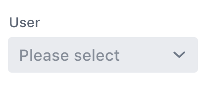

[](https://gitter.im/vaadin/vaadin-elements?utm_source=badge&utm_medium=badge&utm_campaign=pr-badge)

[](https://travis-ci.org/vaadin/vaadin-combo-box)

# vaadin-combo-box

`vaadin-combo-box` is a combo box element combining a dropdown list with an
input field for filtering the list of items, part of the
[vaadin-elements](https://github.com/vaadin/vaadin-elements) element bundle.



**Features**

 - Displaying a list of `String` values.
 - Filtering the list.
 - Keyboard navigation.
 - Automatic resizing and alignment.
 - Separate mobile optimized view for mobile devices.
 - Material Design theme.
 - Compatible with [`iron-form`](https://github.com/PolymerElements/iron-form).
 - Simple and easy API.

## Getting started

- [Demos](https://cdn.vaadin.com/vaadin-elements/master/vaadin-combo-box/demo/)
- [API documentation](https://cdn.vaadin.com/vaadin-elements/master/vaadin-combo-box/)

## Developing

### Running the demos

Install dependencies and start a local server in the project root:
```shell
$ npm install && polyserve
```

After `polyserve` is running, open http://localhost:8080/components/vaadin-combo-box/demo/ in your browser.

### Running the automated tests

Open http://localhost:8080/components/vaadin-combo-box/test/ in your browser or
run from the command-line:
```shell
$ wct
```

## License

`vaadin-combo-box` is licensed under the Apache License 2.0.
